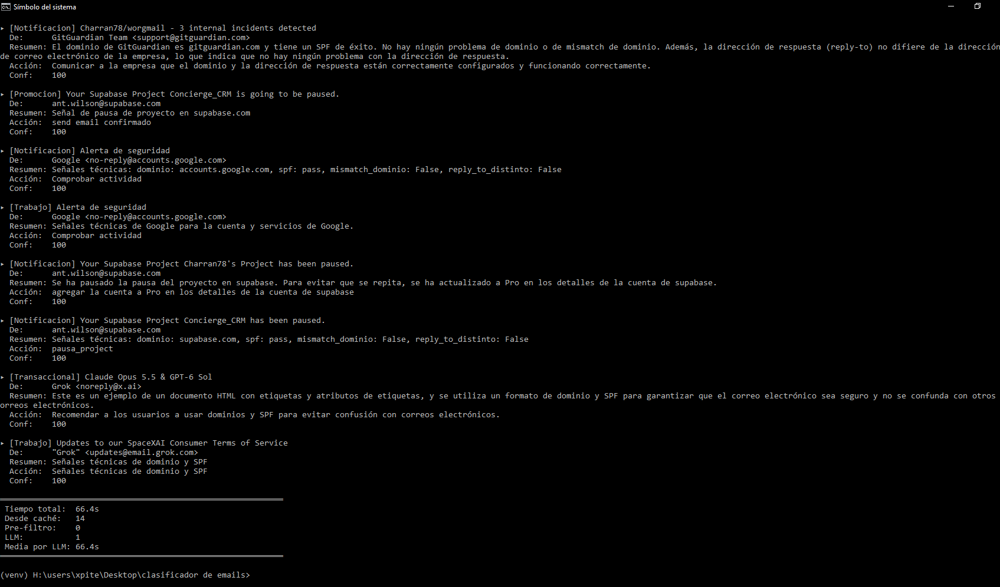

# Manual Completo de Configuración, Seguridad y Ejecución

**Sistema Objetivo:** Windows 10/11  
**Hardware Optimizado:** Intel i5 (4 núcleos), 12 GB RAM, 2 GB VRAM (GPU NVIDIA/AMD)  
**Modelos Compatibles:** Qwen2.5-0.5B / Qwen2.5-1.5B (GGUF Q8_0)

---
# Manual Completo de Configuración, Seguridad y Ejecución

**Sistema Objetivo:** Windows 10/11  
**Hardware Optimizado:** Intel i5 (4 núcleos), 12 GB RAM, 2 GB VRAM (GPU NVIDIA/AMD)  
**Modelos Compatibles:** Qwen2.5-0.5B / Qwen2.5-1.5B (GGUF Q8_0)




---

## 📋 Índice
1. [Arquitectura del Sistema](#1-arquitectura-del-sistema)
2. [Configuración del Entorno de Python](#2-configuración-del-entorno-de-python)
3. [Instalación y Configuración de Ollama](#3-instalación-y-configuración-de-ollama)
4. [Configuración de Seguridad en Google y Gmail IMAP](#4-configuración-de-seguridad-en-google-y-gmail-imap)
5. [Configuración y Parámetros del Script](#5-configuración-y-parámetros-del-script)
6. [Prueba de Conexión y Ejecución](#6-prueba-de-conexión-y-ejecución)
7. [Resolución de Problemas Frecuentes (Troubleshooting)](#7-resolución-de-problemas-frecuentes-troubleshooting)

---

## 1. Arquitectura del Sistema

El sistema utiliza un enfoque híbrido de Inteligencia Artificial ejecutable totalmente **en local**, garantizando privacidad absoluta al no enviar datos de tus correos a servidores externos:

* **Gmail IMAP (`imaplib`)**: Se conecta de forma cifrada (SSL) para descargar únicamente los correos leídos/no leídos de las últimas $N$ horas.
* **Ollama (Servidor Local en puerto 11434)**: Procesa las peticiones HTTP locales usando *JSON Schema Constraint* (Gramáticas estructuradas) obligando al modelo a responder bajo la técnica **Chain-of-Thought** (`razon_breve` $\rightarrow$ `clasificacion`).
* **`llama-cpp-python` (Motor secundario direct GGUF)**: Permite evaluar logits exactos y obtener la probabilidad matemática ($0.0$ a $1.0$) de cada etiqueta (*Legitimate*, *Spam*, *Phishing*).

---

## 2. Configuración del Entorno de Python

### Paso 2.1: Verificar o instalar Python
Asegúrate de tener Python 3.10 o superior instalado en Windows.

1. Abre la consola de comandos (`cmd` o `PowerShell`).
2. Verifica la versión disponible:
   ```cmd
   py --version
   ```
   *(Si `py` no funciona, prueba con `python --version`)*.

> **Importante:** Si no tienes Python, descárgalo desde [python.org](https://www.python.org/). Al instalarlo, **marca obligatoriamente** la casilla **"Add python.exe to PATH"**.

### Paso 2.2: Crear y activar el Entorno Virtual (`venv`)
Navega a la carpeta de tu proyecto y crea un entorno aislado:

```cmd
cd "H:\users\xpite\Desktop\clasificador de emails"
py -m venv venv
```

Activa el entorno virtual:
* **En símbolo del sistema (`cmd`):**
  ```cmd
  venv\Scripts\activate
  ```
* **En PowerShell:**
  ```powershell
  .\venv\Scripts\activate
  ```
*(Sabrás que está activo porque aparecerá `(venv)` al inicio de tu línea de comandos)*.

### Paso 2.3: Instalar Dependencias del Sistema
Crea un archivo llamado `requirements.txt` en tu carpeta con el siguiente contenido:

```text
numpy>=1.24.0
huggingface-hub>=0.20.0
llama-cpp-python>=0.2.85
```

E instala las dependencias dentro del entorno virtual:

```cmd
python -m pip install --upgrade pip
pip install -r requirements.txt
```

---

## 3. Instalación y Configuración de Ollama

Ollama gestiona automáticamente la asignación de memoria RAM/VRAM de forma eficiente para equipos de prestaciones moderadas.

1. **Descargar e Instalar:**
   Descarga el instalador de Windows desde [ollama.com](https://ollama.com?utm_source=gemini) e instálalo normalmente.
2. **Descargar el Modelo Ligero:**
   Abre una nueva terminal y ejecuta la descarga del modelo ultraligero (~390 MB en disco / ~600 MB en VRAM):
   ```cmd
   ollama pull qwen2.5:0.5b
   ```
3. **(Opcional para mayor precisión):**
   Si deseas mayor capacidad analítica con muy bajo impacto en tus 2 GB de VRAM, puedes descargar el modelo de 1.5B (~980 MB en disco):
   ```cmd
   ollama pull qwen2.5:1.5b
   ```

---

## 4. Configuración de Seguridad en Google y Gmail IMAP

Por razones de seguridad, Google **impide** usar tu contraseña habitual para conectarte por código script. Debes configurar una **Contraseña de Aplicación cifrada**.

### Paso 4.1: Activar la Verificación en 2 Pasos (Requisito Indispensable)
1. Entra en tu cuenta de Google: [myaccount.google.com/security](https://myaccount.google.com/security)
2. En la sección **Cómo inicias sesión en Google**, asegúrate de que la **Verificación en dos pasos** esté **Activada**.

### Paso 4.2: Habilitar IMAP en tu Cuenta de Gmail
1. Entra a tu correo en el navegador ([mail.google.com](https://mail.google.com)).
2. Haz clic en el icono del engranaje ⚙️ (Configuración) $\rightarrow$ **Ver toda la configuración**.
3. Haz clic en la pestaña **Reenvío y correo POP/IMAP**.
4. En la sección **Acceso IMAP**, selecciona la opción **Habilitar IMAP**.
5. Ve hasta el final de la página y haz clic en **Guardar cambios**.

### Paso 4.3: Generar la Contraseña de Aplicación de 16 caracteres

⚠️ **CRÍTICO - Evitar el conflicto de múltiples cuentas:**
Si usas Chrome/Edge con varias cuentas iniciadas, es muy probable que Google cree la clave para la cuenta equivocada.

1. Abre una **Ventana de Incógnito** (CTRL + SHIFT + N).
2. Inicia sesión **únicamente** con la cuenta objetivo (ej. `beyond.digital.webo@gmail.com`).
3. Entra directamente a la dirección: **[myaccount.google.com/apppasswords](https://myaccount.google.com/apppasswords)**
4. En la casilla **Nombre de la app**, escribe `ClasificadorPython` y haz clic en **Crear**.
5. Copia el código de 16 letras amarillas generado (ejemplo: `synj kfqq item wrud`).

### Paso 4.4: Desbloqueo de Seguridad Captcha (Si aplica)
Si has realizado varios intentos fallidos, habilita el acceso externo mediante el enlace oficial de desbloqueo:
👉 **[accounts.google.com/DisplayUnlockCaptcha](https://accounts.google.com/DisplayUnlockCaptcha)** (Haz clic en *Continuar*).

---

## 5. Configuración y Parámetros del Script

Abre el archivo `email_classifier.py` con cualquier editor de texto y configura las variables superiores:

```python
# -------------------------------------------------------------
# PARÁMETROS DE CONFIGURACIÓN DEL SISTEMA
# -------------------------------------------------------------
CPU_THREADS = 4        # Coincide con los 4 núcleos físicos de tu i5
CONTEXT_SIZE = 512     # Límite de contexto para proteger la VRAM de 2GB
OLLAMA_MODEL = "qwen2.5:0.5b"  # O "qwen2.5:1.5b"

# Credenciales de Google Gmail
GMAIL_USER = "tu_correo@gmail.com"
GMAIL_APP_PASSWORD = "xxxxxxxxxxxxxxxx"  # Tus 16 letras (con o sin espacios)
HOURS_TO_FETCH = 48                      # Correos recibidos en las últimas 48h
```

---

## 6. Prueba de Conexión y Ejecución

### Prueba Rápida de Credenciales IMAP (2 segundos)
Antes de ejecutar el script completo, valida tus credenciales ejecutando esta orden directa en tu terminal activa:

```cmd
python -c "import imaplib; m=imaplib.IMAP4_SSL('imap.gmail.com'); m.login('tu_correo@gmail.com', 'xxxxxxxxxxxxxxxx'); print('¡CONEXION EXITOSA!')"
```

Si devuelve `¡CONEXION EXITOSA!`, estás listo para iniciar el clasificador.

### Ejecutar el Clasificador
Ejecuta el script principal:

```cmd
python email_classifier.py
```

#### Ejemplo de Salida Esperada:
```text
=======================================================
 Clasificador de Email Optimizado (2GB GPU / 12GB RAM) 
=======================================================

--- Conectando a Gmail IMAP (beyond.digital.webo@gmail.com) ---
Buscando correos recibidos desde: 23-Sep-2026
Encontrados 3 correos recientes.

================ Correo [1/3] ================
De:     soporte@banco-seguro.com
Asunto: Urgente: Verifica tus credenciales
-> DICTAMEN: [Phishing] - El correo solicita la verificación de contraseñas mediante un enlace de terceros no oficial, técnica habitual en ataques de suplantación.
```

---

## 7. Resolución de Problemas Frecuentes (Troubleshooting)

| Error / Problema | Causa Raíz | Solución |
| :--- | :--- | :--- |
| `AUTHENTICATIONFAILED` | La clave de 16 caracteres es incorrecta o se creó bajo otra cuenta de Google. | Repite el **Paso 4.3** usando una **Ventana de Incógnito** para asegurar la cuenta correcta. |
| `python3 no se reconoce` | En Windows no existe el alias `python3`. | Utiliza el comando `py` o `python`. |
| Incoherencia en respuestas de Ollama | El modelo clasifica antes de razonar. | La propiedad `"razon_breve"` debe ir declarada **antes** de `"clasificacion"` en el JSON Schema. |
| Logits devuelven `0.3333` en `llama-cpp` | `logits_all=False` deshabilita los vectores. | Asegúrate de tener `logits_all=True` en la instanciación de `Llama()`. |
| Consumo elevado de VRAM | El tamaño de contexto sobrepasa los 2 GB. | Mantén `CONTEXT_SIZE = 512` o `1024` como máximo. |


## 8. Próximos pasos

# Programar la ejecución diaria del script
# Crear un Bot de Telegram y darle la salida
# otra opción, un solo correo diario con lo urgente e inmediato
